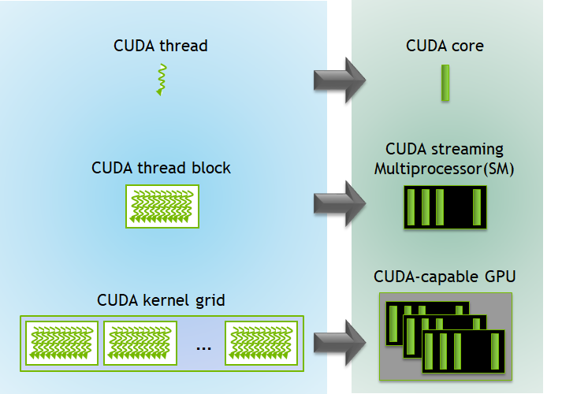
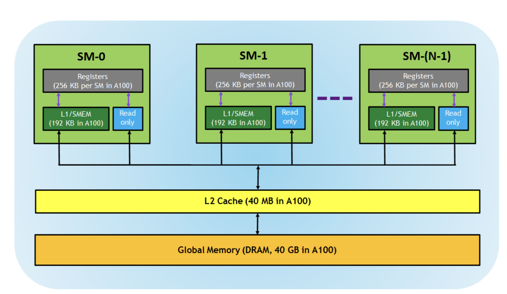
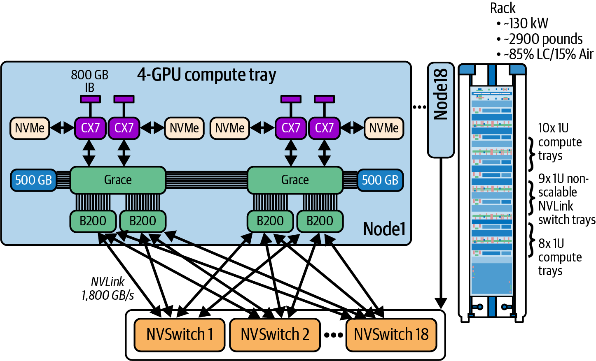

## 1. CUDA 프로그래밍

[https://developer.nvidia.com/blog/cuda-refresher-cuda-programming-model/](https://developer.nvidia.com/blog/cuda-refresher-cuda-programming-model/) 

### 1.1 Host vs Device — heterogeneous

- **Host** = 시스템의 CPU, 딸린 시스템 메모리가 **host memory**
- **Device** = GPU, GPU 메모리가 **device memory**
- CUDA 프로그램 실행 단계
  1. **H2D 전송** — 입력 데이터를 host memory → device memory 복사
  2. **커널 실행** — GPU 프로그램 로드 후 실행, 데이터를 on-chip에 캐싱
  3. **D2H 전송** — 결과를 device memory → host memory 복사
- Host와 device가 각각 별도의 메모리 공간을 가진다는 가정이 모델의 전제이고, 둘 사이 데이터 전송은 PCIe 버스를 통한다.
  - GB200 계열부터는 CPU ↔ GPU가 NVLink-C2C로 변경

### 1.2 노드 물리 구조 (H200 NVL 기준)

```yaml
┌──────────────── 서버 1대 (노드) ────────────────────┐
│                                                  │
│   ┌─────────┐        ┌─────────┐                 │
│   │ CPU 0   │        │ CPU 1   │   ← host        │
│   │ (소켓)   │──UPI── │ (소켓)   │                 │
│   └────┬────┘        └─────┬───┘                 │
│        │  DDR              │  DDR   ← host mem   │
│        │                   │                     │
│     ═══╧═══ PCIe ══════════╧══════════════       │
│        │   │   │   │     │   │   │   │           │
│      ┌─┴┐┌─┴┐┌─┴┐┌─┴┐  ┌─┴┐┌─┴┐┌─┴┐┌─┴┐          │
│      │G0││G1││G2││G3│  │G4││G5││G6││G7│ ← device │
│      └──┘└──┘└──┘└──┘  └──┘└──┘└──┘└──┘          │
│       └── NVLink 쿼드 ──┘  └── 쿼드 ──┘            │
│                                        HBM = device memory
└──────────────────────────────────────────────────┘
```

- host는 노드당 1개, device는 보통 노드당 8개
- software 입장에서는 `1 프로세스 : 1 device`로 쓴다 (`torchrun --nproc_per_node=8`)
- 각 프로세스 입장에서는 host 1 : device 1


### 1.2 CUDA kernel & thread

- kernel execute as a set of parallel Threads
- CUDA is designed to execute 1000’s of Threads
- SIMD(Single Instruction Multiple Data)
  - 하나의 명령으로 여러개의 데이터를 얻어내는 방식
- SMIT : Thread 중심
  - 100만개의 스레드를 1000개의 core로
  - thread를 묶고, core를 묶어서 둘 간을 매핑

```
Grid  ──┬── Block 0 ──┬── Thread (0,0,0)
        │             ├── Thread (1,0,0)
        │             └── ...  (최대 1024개)
        ├── Block 1
        └── ...
```

- left : software(logical) / right : hardware(물리적)



### 1.4 Memory hierarchy




| 계층                            | 범위          | 특징                                                                           |
| ----------------------------- | ----------- | ---------------------------------------------------------------------------- |
| **Register**                  | 스레드 private | 다른 스레드에서 보이지 않고, 컴파일러가 사용량을 결정                                               |
| **L1 / Shared memory (SMEM)** | SM 내부       | SM마다 있는 빠른 on-chip memory                                                    |
| **Read-only**                 | SM 내부       | instruction cache, constant memory, texture memory, RO cache — 커널 코드에서 읽기 전용 |
| **L2 cache**                  | 전체 SM 공유    | 모든 block의 모든 스레드가 접근 가능                                                      |
| **Global memory**             | device 전체   | GPU에 붙은 DRAM, 프레임버퍼 크기                                                       |


- **위로 갈수록 빠르고 작다**
- 대역폭 차이가 대략 수십~수백 배 나기 때문에, 커널 최적화는 거의 항상 "global memory 접근을 줄이고 shared memory/register 재사용을 늘리는 것"이 핵심


## Part 2. GPU 내부 구조


### 2.1 Die / Package / Module / Node

```
Die (다이)        실리콘 조각 자체. Blackwell은 다이 2개
   ↓
Package (패키지)  다이 + HBM 스택을 substrate에 얹어 몰딩한 것. 이게 "칩"
   ↓
Module (모듈)     패키지 여러 개를 하나의 PCB 캐리어에 납땜한 것
   ↓
Node (노드)       모듈들을 baseboard/섀시에 꽂아 조립한 서버
```


|              | 조립 형태                 | CPU↔GPU 거리 | 교체       |
| ------------ | --------------------- | ---------- | -------- |
| **H200 NVL** | PCIe 카드를 슬롯에 꽂음       | 수십 cm      | 카드 단위 가능 |
| **H200 SXM** | SXM 모듈을 baseboard에 장착 | 수십 cm      | 모듈 단위 가능 |
| **GB200**    | CPU/GPU가 한 보드에 납땜     | **수 cm**   | X        |


### 2.2 Blackwell Dual-Die

- 두 die는 NV-HBI(High-Bandwidth Interface)로 연결
- 덕분에 2개 die가 하나의 GPU처럼 동작
- **software 입장에서는 single GPU로 보임** — `nvidia-smi`에도 1장으로 뜬다


### 2.3 Blackwell Architecture



**Node 내부**

- `800GB/s` → 랙 외부로 나가는 InfiniBand 포트
- `CX7` 4개 = ConnectX 계열 NIC, 트레이당 4장
- 랙 간 통신과 스토리지 접근이 전부 이 경로
- **NVMe**
  - 로컬 SSD, CX7과 양방향 연결
  - 화살표가 CPU를 안 거치고 CX7로 직결
    - 데이터를 CPU 메모리에 거치지 않고 옮김
- **Grace CPU 2개**
  - 각각 `500 GB` 메모리(LPDDR5X) 부착 → 트레이당 CPU 메모리 약 1TB
  - Grace ↔ B200 사이 굵은 다중선 = **NVLink-C2C**
- **B200 4개**
  - Grace 1개당 B200 2개 = **Superchip** 단위

**GPU ↔ GPU : NVLink / NVSwitch**

- B200 각각이 **NVSwitch 18개 전부에** 링크 1개씩 연결
- GPU당 18 × 100 GB/s = **1,800 GB/s**

**CPU ↔ GPU: PCIe → NVLink-C2C**

- CPU / GPU는 각각 별도 memory pool → PCIe slow bus로 연결되었었음
- NVIDIA가 자체 CPU **Grace**를 내면서 CPU-GPU를 NVLink-C2C(chip-to-chip)로 tightly-linked superchip 등장
- 같은 주소 공간에서 메모리 직접 접근 가능 (coherent unified memory)
- 한 모듈 안에 **HBM + LPDDR** 공존


### 2.4 NVLink vs InfiniBand


|        | NVLink / NVSwitch              | InfiniBand                    |
| ------ | ------------------------------ | ----------------------------- |
| 성격     | 메모리버스                          | 네트워크                          |
| 접근 방식  | GPU가 원격 메모리를 **직접 load/store** | 메시지를 **보내고 받음**               |
| 주소 공간  | GPU 간 공유 (PGAS)                | 없음, 명시적 전송                    |
| 경로     | GPU → NVSwitch → GPU           | GPU → NIC → 스위치 → NIC → GPU   |
| CPU 개입 | 없음                             | GPUDirect RDMA로 최소화하지만 NIC 경유 |
| 범위     | 보통 gpu 간                       | 보통 Node 간                     |


### 2.5 우리 환경의 h200은 NVL

- [4장 씩 nvlink]—SYS(PCIe)—[4장씩 nvlink]
<details>
<summary>TP8 bandwidth 측정 결과 (NVLink ~132 GB/s vs SYS ~39 GB/s)</summary>

- TP4까지는 괜찮은데 TP8에서 속도 이슈 생김

```shell
0->1:   131.5 GB/s  NVLink
0->2:   131.7 GB/s  NVLink
0->3:   131.7 GB/s  NVLink
0->4:    38.8 GB/s  SYS
0->5:    38.7 GB/s  SYS
0->6:    38.5 GB/s  SYS
0->7:    38.5 GB/s  SYS
1->2:   131.8 GB/s  NVLink
1->3:   131.6 GB/s  NVLink
1->4:    39.0 GB/s  SYS
1->5:    38.7 GB/s  SYS
1->6:    38.7 GB/s  SYS
1->7:    38.5 GB/s  SYS
2->3:   131.9 GB/s  NVLink
2->4:    38.8 GB/s  SYS
2->5:    39.0 GB/s  SYS
2->6:    38.7 GB/s  SYS
2->7:    38.5 GB/s  SYS
3->4:    38.7 GB/s  SYS
3->5:    38.5 GB/s  SYS
3->6:    38.8 GB/s  SYS
3->7:    38.4 GB/s  SYS
4->5:   131.9 GB/s  NVLink
4->6:   131.9 GB/s  NVLink
4->7:   132.0 GB/s  NVLink
5->6:   132.1 GB/s  NVLink
5->7:   131.8 GB/s  NVLink
6->7:   131.9 GB/s  NVLink
```
</details>


## **Part 3. low precision(8bit, 4bit)**

- bit 수가 적음 → 같은 시간에 더 많은 연산 + 같은 데이터를 더 적은 memory로 표현
- precision과의 trade off..
- FP4 format
  - MXFP4
  - NVFP4 : nvidia 규격, block이 16으로 더 적어서 세밀하게 scale 적용
  - MXFP4보다 NVFP4가 더 성능 drop분이 적다
- FP16 vs BF16
  - 6.022(mantissa) × 10^^23(exponent)
  - FP16
    - exponent 5bit → **범위가 좁음**
    - mantissa 10bit → **정밀도는 상대적으로 높음**
    - 문제: 딥러닝에서 gradient처럼 아주 작은 값이나 큰 값이 나오면 overflow/underflow 발생 높음
  - BF16
    - exponent 8bit → **FP32와 똑같은 범위**를 가짐 (이게 핵심 장점)
    - mantissa 7bit → **정밀도는 FP16보다 낮음**
    - 장점: 범위가 FP32와 같으니 overflow/underflow 걱정이 거의 X **FP32 값을 그냥 잘라낸(truncate) 것처럼** 안전하게 쓸 수 있음
- [https://huggingface.co/LGAI-EXAONE/EXAONE-4.5-33B-FP8](https://huggingface.co/LGAI-EXAONE/EXAONE-4.5-33B-FP8)
  - Tensor types: BF16 · F8_E4M3
    - 원본레이어는 BF16
    - Post-training quantize된 부분은 F8_E4M3, 즉 FP8의 E4M3 변형 (exponent 4bit + mantissa 3bit)
- **Transformer Engine (TE)** = mixed precision을 자동 조절하는 기술
  - 중요한 layer는 높은 precision (FP16 / BF16), 덜 중요한 layer는 낮은 precision (FP8 / FP4)
  - inference에서도 자동으로 조절이 가능할까?

